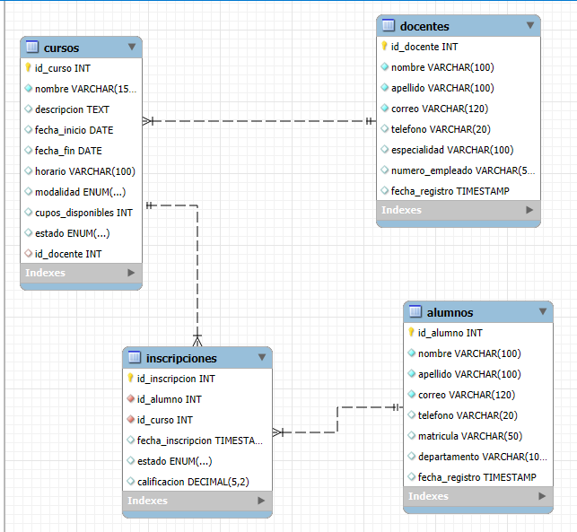
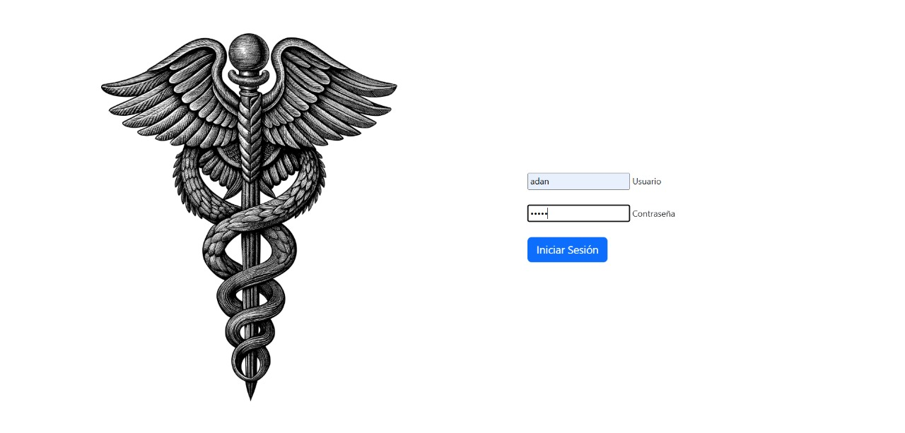
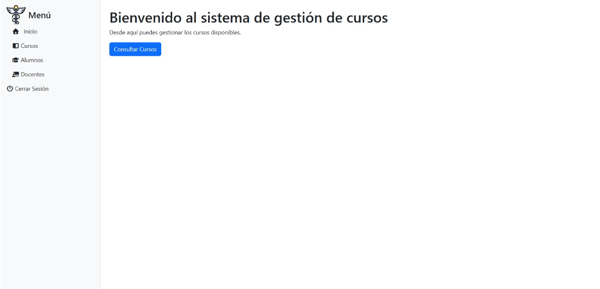
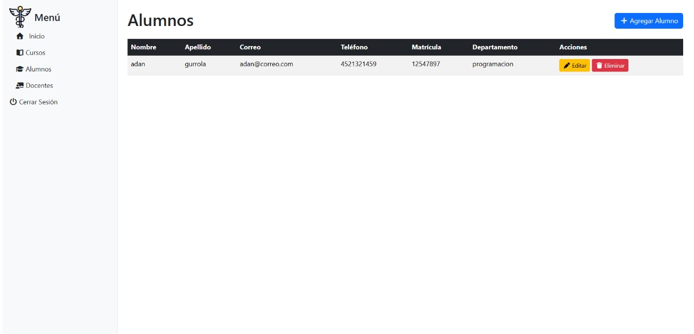
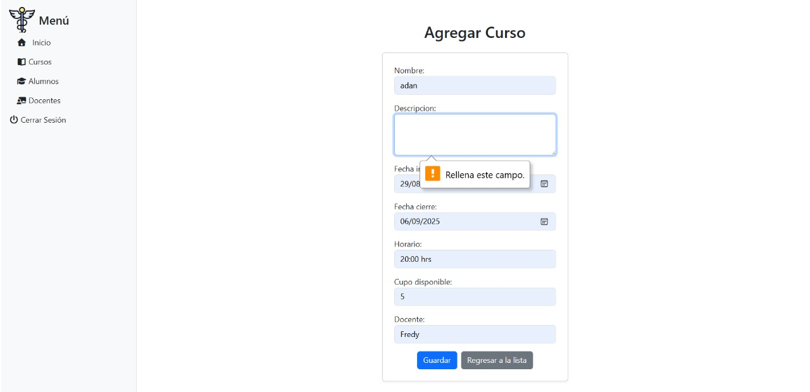
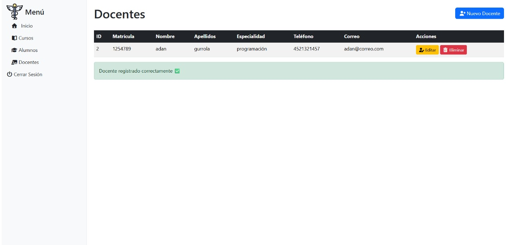
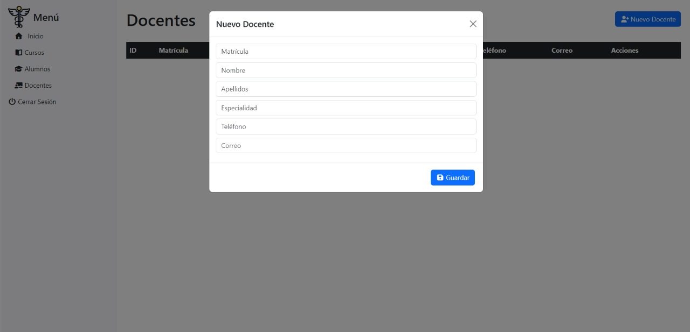
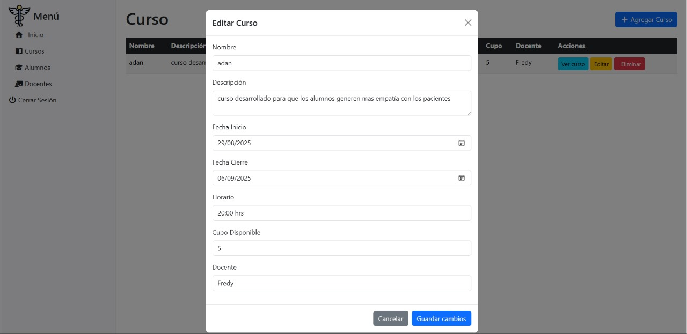
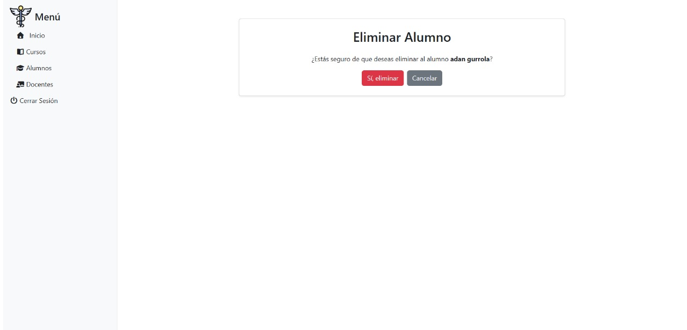
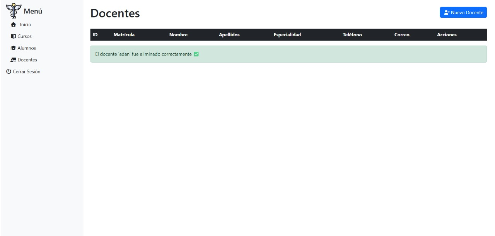

# CRUD Cursos-Hospital

📖 Resumen:
Este proyecto es un CRUD desarrollado en Django para administrar cursos medicos que son impartidos en un hospital
para la formacion del personal que labora en la institución.
Permite la gestión de docentes, alumnos y cursos, incluyendo la visualizacion, la creacion, modificacion y eliminación
de los registros.

Para el almacenamiento de datos, el sistema se conecta con una base de datos MariaDB.

🗄️ Modelo Entidad-Relación (ER):

El modelo de datos define la relación entre los docentes, cursos y alumnos.

* Un docente puede impartir varios cursos.
* Un curso puede tener varios alumnos.
* Un alumno puede estar inscrito en varios cursos.

 

⚙️ Instalación y ejecución:

1. Clonar el repositorio
    * git clone https://github.com/EduardoPicazo/crud_PM.git
    * cd crud_PM

2. Instalar dependencias
    * pip install -r requirements.txt

3. Configurar variables de entorno
    * Copia el archivo .env.example a .env y actualiza los valores con tus credenciales:

    DB_NAME=tu_db
    DB_USER=tu_usuario
    DB_PASSWORD=tu_contraseña
    DB_HOST=localhost
    DB_PORT=ejp: 3306

4. Migrar base de datos
    * python manage.py migrate

5. Crear superusuario
    * python manage.py createsuperuser

6. Ejecutar servidor
    * python manage.py runserver

🌐 Rutas clave

* /docentes/ → Listado de docentes
* /docentes/agregar/ → Crear docente
* /alumnos/ → Listado de alumnos
* /alumnos/agregar/ → Crear alumno
* /cursos/ → Listado de cursos
* /agregar/ → Crear curso

🗃️ Base de datos y migraciones

* El proyecto usa MariaDB como base por defecto.
* Incluye todas las migraciones necesarias.
* Opcionalmente puedes cargar datos de prueba con:

    python manage.py loaddata fixtures/seed.json

📂 Evidencia

Ejemplos del CRUD en funcionamiento:

* 

* 

* 

* 

* 

* 

* 

* 

* 

* 